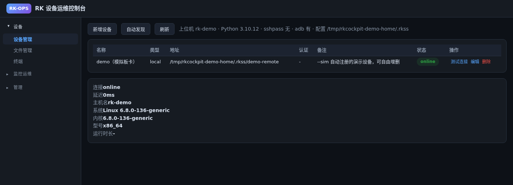
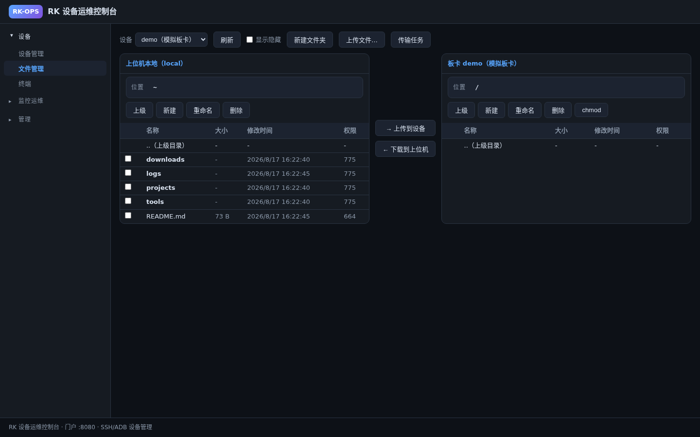
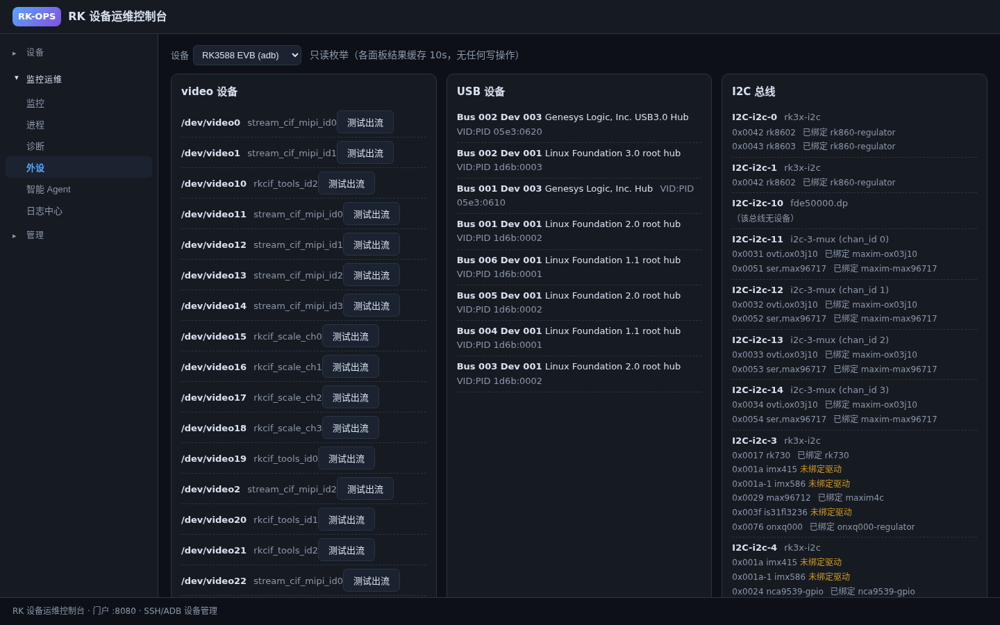

# rkcockpit

[](LICENSE)
[](https://www.python.org/)
[](CONTRIBUTING.md)

[中文版](README.zh-CN.md)

rkcockpit is a **zero-dependency** web operations console for Rockchip (RK)
devices (e.g. RK3588 / RK3568 / RV1126 and friends) reachable over SSH, ADB, or
locally. Device management, XFTP-style dual-pane file transfer, web terminal,
system monitoring, process control, camera stream tests, peripherals
enumeration (I2C/GPIO/PWM/SPI/UART/clk/watchdog/regulator/DMA), batch deploy,
log center, key & group management, operation audit, and a built-in LLM agent.
Pure Python 3.9 stdlib backend (`http.server`/`urllib`), vanilla HTML/JS frontend.

## Architecture

Run the portal on the **PC used as the operations host**. The local side of the
file manager, local commands, configuration, discovery, and audit data all
belong to the machine running the portal. Managed RK boards are remote targets
reached from that PC through ADB or SSH.

Running the portal on a board is supported only as an optional standalone
mode. In that topology, “local” means that board, so it is not the default
host-side deployment described below.

## Directory

```
host/      Host backend: devices, transports, exec, jobs, monitor, deploy
portal/    Portal HTTP service + auto-discovery
static/    Single-page frontend (left sidebar navigation)
deploy/    systemd unit and install script
docs/      Design and closeout documents
tests/     End-to-end tests (stdlib unittest)
```

## Features

A zero-dependency web console for any RK device reachable over SSH, ADB, or
locally: device management, XFTP-style dual-pane file transfer, web terminal,
system monitoring, process management, diagnostics, batch deployment, log
center, key and group management, and operation audit. The backend is pure
Python 3.9 stdlib (`http.server`/`urllib`); the frontend is vanilla HTML/JS.

## Screenshots

### Device management



### Dual-pane file manager



### RK3588 peripherals



## Intelligent Agent

Built-in agent (OpenAI-compatible), delivered in three phases: P0 chat with
read-only tools, P1 streaming SSE that shows the tool-call chain, and P2 write
tools with audit. It provides 12 controlled tools — 6 read-only (device list,
connectivity check, system info, diagnostics, monitoring, file list) and 6
write (command run, command kill, file write, file ops, deployment plan,
process signal). Write operations run immediately and leave automatic audit
trails. Configure an OpenAI-compatible service in `llm.json` under the config
directory (default `~/.rkss`, override with `--conf-dir`); the API key is never
written to logs or audit records.

## Quick Start

```bash
# Run these commands on the PC, from the repository root.
python3 -m portal.portal
# Open http://127.0.0.1:8080

# Optional UI demo with a simulated local device:
python3 -m portal.portal --sim
```

(Optional) To enable the agent, create `~/.rkss/llm.json` with an
OpenAI-compatible `base_url`.

The left sidebar has three groups: Devices (device/file/terminal), Monitoring
& Ops (monitor/process/diagnose/deploy/log center), and Admin (keys/groups/
audit); it lands on Devices by default.

## Auto-Discovery and Import

The portal auto-discovers hosts reachable over SSH or ADB: ADB parses
`adb devices -l`; SSH probes candidates from ARP neighbors, `~/.ssh/config`,
`~/.ssh/known_hosts`, and saved devices over TCP 22, requiring an `SSH-`
banner. In Device Management, click Auto-Discover to select (all/invert) and
import devices (deduplicated by type+host); SSH import asks for the login user
(default root), then runs a per-device connection check. Discovery results
support block rules (IP/CIDR/wildcard/ADB SN, persisted in
`~/.rkss/discovery-rules.json`).

## Deployment (PC host, Debian/Ubuntu)

```bash
sudo apt install -y openssh-client sshpass adb python3
mkdir -p ~/.rkss && chmod 700 ~/.rkss
python3 -c 'import secrets; print(secrets.token_urlsafe(32))' > ~/.rkss/auth-token
chmod 600 ~/.rkss/auth-token
python3 -m portal.portal --bind 127.0.0.1 --port 8080 \
  --auth-token-file ~/.rkss/auth-token
# Install a loopback-only systemd service on this PC:
sudo ./deploy/install.sh portal --user "$USER"
# Production HTTPS with an existing certificate (no automatic ACME/issuance):
sudo ./deploy/install.sh portal --user "$USER" --tls-nginx portal.example.com \
  /etc/ssl/portal/fullchain.pem /etc/ssl/portal/key.pem
```

The backend and frontend use only the Python 3.9+ standard library; there is no
`pip install`, `requirements.txt`, or `pyproject.toml` installation step. The
PC needs `adb` only for ADB targets and `sshpass` only for password-based SSH.
Each managed board needs the corresponding reachable transport: an authorized
ADB connection or an SSH server and credentials. It does not need Python or a
portal process merely to be managed by the PC.

- Password auth requires `sshpass`; key auth uses `~/.ssh` default or managed
  keys. SSH execution is fail-closed against a private
  `~/.rkss/ssh-known-hosts`; it never accepts a first-seen key automatically.
  Obtain the device's SHA256 host-key fingerprint through an independent,
  trusted channel, then pin the discovered key explicitly:

  ```bash
  ./tools/pin_ssh_host.py --host 192.0.2.10 --port 22 \
    --fingerprint SHA256:OUT_OF_BAND_VALUE \
    --known-hosts-file ~/.rkss/ssh-known-hosts
  ```

  `ssh-keyscan` only discovers a candidate; matching the independently supplied
  fingerprint is what authorizes it. A changed key is rejected, never replaced.
- First ADB use needs manual confirmation (`adb devices`).
- `--bind` defaults to `127.0.0.1`, where authentication is optional for local
  development. Direct non-loopback HTTP is rejected even with a token. The
  explicit `--trusted-http` escape hatch prints a warning and is only for a
  network already protected by VPN or equivalent encryption. `--external-https`
  marks login/logout cookies `Secure` and must be used only behind HTTPS.
- The systemd installer atomically creates `/etc/rkss-portal/auth-token` in a
  root-controlled directory and never prints the secret. `--user USER` selects
  an existing non-root service account; without it, the installer tries
  `RKSS_RUN_USER`, a non-root `SUDO_USER`, then the source-tree owner. Its real
  primary group and home directory are resolved from the system. Read the token
  as that account to log in. Browser login exchanges it for an 8-hour HttpOnly
  cookie; scripts may send `Authorization: Bearer <token>`. The service binds only
  `127.0.0.1:8080`; the optional nginx profile validates an existing certificate
  and key, enables TLS 1.2/1.3, SSE streaming, request-size limits, HSTS and
  security headers. It never requests or creates a certificate.
- Upgrades are staged under `/opt/rkss-webui/releases`, then atomically switch
  `current`. `last-good` points to the prior working release; a failed service
  restart restores the prior release and unit. Token/config files remain outside
  releases under `/etc/rkss-portal` and the selected user's `~/.rkss`.
- Token authentication does **not** encrypt HTTP traffic. Keep port 8080 on
  loopback and use the documented HTTPS proxy, an SSH tunnel, or a VPN.

## HTTP API

The portal exposes `/api/*` endpoints for health, discovery, devices, file
transfer, exec, monitor/process/diagnose/deploy, jobs, keys/groups/audit, and
the log center. See the full contract in `docs/02-host-design.md` §3 (V2 API
contract, still valid; the V1 cluster part is deprecated). When authentication
is enabled, `/api/health`, the static login shell, and `/api/auth/*` remain
public; all other API routes require the session cookie or Bearer token.

## Tests

```bash
python3 -m unittest discover -s tests
```

## Releases and Versioning

rkcockpit currently uses the `0.x.y` Semantic Versioning series. Releases are
readiness-based, with minor releases targeted approximately every 4–8 weeks.

See the [release and versioning policy](docs/RELEASE.md) for branch, tag,
compatibility, support, and release-note requirements.

## Contributing

Contributions are welcome! Issues labeled `good first issue` are a friendly
starting point. For anything larger, please open an issue first
to align on scope. See [CONTRIBUTING.md](CONTRIBUTING.md).
